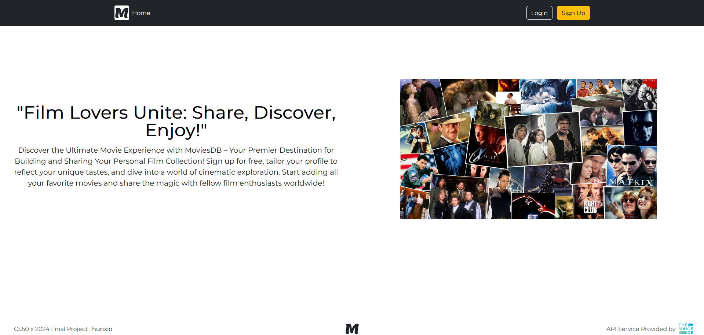

# CS50x Final Project

## Contents
- [Introduction](#introduction)
- [Resources](#resources)
- [Contact](#contact)

## Introduction

This is the final project for CS50 x 2024 made by <a href="https://www.github.com/hunxio/">hunxio</a>.
This project wants to create a website, called MoviesDB, where people can sign up an account
and get access to the daily top trending movies and not only; it will also give the user the opportunity to create
its own personal collection of movies, or manage its account in case they need to modify the password or username.
This website is hosted locally.
I gave myself a month to get as much done for this project, even though some of the ideas and parts are missing (you can check the planning in planning/plan.drawio),
I am quite happy about the results. *Quack!*
 

## Resources

<b>CS50x2024 Course:</b>
https://www.edx.org/

<b>Bootstrap for front-end resources:</b>
https://getbootstrap.com/

<b>API Service provided by:</b>
https://www.themoviedb.org/

<b>Flask Documentation:</b>
https://flask.palletsprojects.com/en/3.0.x/

<b> Flask installation and Virtual Enviroment Set up:</b>
https://phoenixnap.com/kb/install-flask

<b>Python, HTML, CSS Resources:</b>
https://www.w3schools.com/

## Contact

For more informations about this project, visit my github profile 

