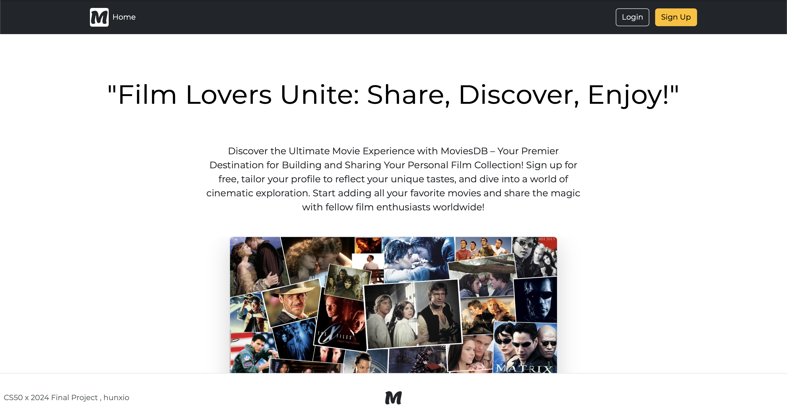

# CS50 Final Project

This is the final project for CS50 x 2024 made by <a href="https://www.github.com/hunxio/">hunxio</a>.

## Contents
- [Introduction](#introduction)
- [Installation](#installation)
- [Contact](#contact)
- [Additional Resources](#additional-resources)

## Introduction

This project wants to create a social website, called MoviesDB, where you can create your
own personal profile and add movies and tv shows to your collection.


## Installation

In order to test and run it you will need to have Python and Flask installed on your device.
There are already setted up two different virtual enviroments, for Windows and MacOS,
you will only need to activate one of them and run flask:

```bash
$ username CS50Project % flask run
 * Debug mode: off
WARNING: This is a development server. Do not use it in a production deployment. Use a production WSGI server instead.
 * Running on http://123.4.5.6:7890
```
(The numbers after the http will be different)
copy and paste the address showed in the Terminal.
More informations about how to install Python and activate the virtual enviroment
on the following pages:
<ul>
<li>Python Download: https://www.python.org/downloads/ </li>
<li>Virtual Enviroment Activation: https://phoenixnap.com/kb/install-flask</li>
</ul>

## Contact

For more informations about this project, visit my github profile 
<a href="https://www.github.com/hunxio">hunxio</a>.

## Additional Resources

Bootstrap for front-end resources:
https://getbootstrap.com/

